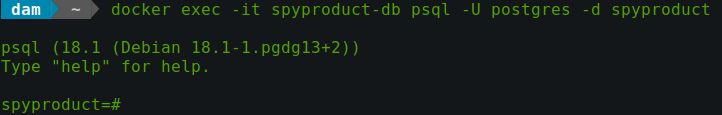
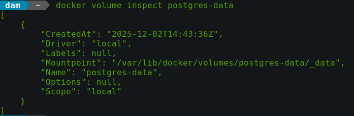

# Preparando nuestro entorno
## Guía paso a paso
En esta guía se verá cómo crear un contenedor Docker, con una imagen base de PostgreSQL y cómo guardar las bases de datos que creemos con volúmenes para que no se pierdan una vez se cierre el contenedor. Esta guía **no** va sobre PostgreSQL sino sobre Docker.

<br>

### Paso 1
Al preparar nuestro entorno, primero debemos tener descargado Docker en nuestra máquina. Empezaremos usando los siguientes comandos:
`docker run --name miblog-db   -e POSTGRES_PASSWORD=1234   -v postgres-data:/var/lib/postgresql/data   -d postgres`
Para crear nuestro contenedor Docker con una imagen base Postgres, donde:

- **"--name"** será el nombre del contenedor
- **"-e POSTGRES_PASSWORD=1234"** será la contraseña postgres (único argumento obligatorio)
- **"-v postgres-data:/var/lib/postgresql/data"** será donde guardemos los volúmenes de nuestro contenedor (guardado del progreso)
- **"-d postgres"** será la imagen base de nuestro contenedor

Tras esto usamos `docker ps` para comprobar que el contenedor se está ejecutando y en caso de que así sea usaremos:

`docker exec -it miblog-db psql -U postgres -d misuperblog`
Donde **"-U postgres"** será el usuario (como no lo especificamos antes, por defecto es postgres) y **"-d misuperblog"** será nuestra base de datos. Esto nos dejará con la siguiente terminal:


### Paso 2
Saldremos del contenedor con `\q` y activaremos los volúmenes para que nuestro trabajo dentro de la base de datos se guarde y no se reinicie cada vez que paremos e iniciemos el contenedor. Para ello usaremos el siguiente comando: 
`docker volume create postgres-data` y para comprobar que haya funcionado usaremos `docker volume inspect postgres-data` Nuestra consola debe imprimir información de nuestro volumen, parecida a esta:


Ahora podemos volver a abrir nuestro contenedor con `docker exec -it miblog-db psql -U postgres -d misuperblog` y empezar a crear las tablas e insertar los datos de las mismas.

### Paso 3
Para la creación de tablas copiaremos las siguientes sentencias en postgres en nuestra terminal `misuperblog=# `

```
CREATE TABLE user(
first_name VARCHAR(255) NOT NULL,
last_name VARCHAR(255) NOT NULL,
verified BOOLEAN DEFAULT false,
password_hash VARCHAR(255),
id_user INT GENERATED ALWAYS AS IDENTITY PRIMARY KEY);

CREATE TABLE blog(
title VARCHAR(255) NOT NULL,
created_in TIMESTAMP DEFAULT CURRENT_TIMESTAMP,
id_user INT REFERENCES user(id_user),
id_blog INT GENERATED ALWAYS AS IDENTITY PRIMARY KEY);

```
Con esto todas las tablas y relaciones estarán construidas.

### Paso 4
Ahora tendremos que introducir nuestra información, que puede ser al gusto pero aquí dejo una por defecto:

```
INSERT INTO usuario(first_name, last_name)
VALUES
('Ivan', 'Mesa'),
('Borja', 'Estevez'),
('Javier', 'Reyes'),
('Yasiel', 'Llanos'),
('Juan', 'Pablo'),
('Gustavo', 'Torres'),
('Alberto', 'Garcia'),
('Peter', 'Alejandro'),
('Jorge', 'Mesa');

INSERT INTO blog(title, id_user)
VALUES
('El dia que me hice skater', 1),
('Como escaparse de clase', 2),
('Oda a Taylor Swift', 4),
('Mi vida en Aragua', 8);

```
Con esto ya tendremos nuestra base de datos, preparada para su uso. Una vez terminemos de usarla saldremos con `\q` y pararemos el contenedor Docker con `docker stop miblog-db` para encenderlo de nuevo usaremos `docker start miblog-db` y ejecutaremos el contenedor para acceder a la base de datos con `docker exec -it miblog-db psql -U postgres -d misuperblog` ya mencionado anteriormente.

Por último, para sacar copias de seguridad usaremos la siguiente sentencia `pg_dump -U postgres -d misuperblog > archivo_de_respaldo.sql`.

